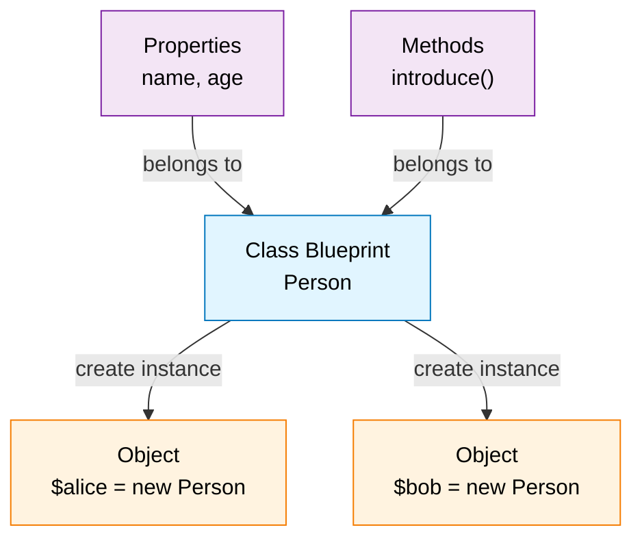

# PHP Classes

> **Last updated:** April 6, 2026  
> **Minimum PHP Version:** PHP 5.0+

## Overview

Object-oriented programming (OOP) is a paradigm that structures code around objects and classes rather than just functions and procedures. A class is a template or blueprint for creating objects, and an object is an instance of a class.

### Class Concept



## When to Use

- Building large, complex applications with many related components
- Creating reusable code across multiple projects
- Implementing design patterns and maintaining clean architecture
- Working with frameworks that use OOP (Laravel, Symfony, Moodle)
- Grouping related data and behavior together

## Basic Example

```php
<?php
class Person {
    public $name;
    public $age;
    
    public function __construct($name, $age) {
        $this->name = $name;
        $this->age = $age;
    }
    
    public function introduce() {
        return "Hello, I'm " . $this->name . " and I'm " . $this->age . " years old.";
    }
}

$person = new Person("Alice", 30);
echo $person->introduce(); 
// Output: Hello, I'm Alice and I'm 30 years old.
?>
```

Procedural programming is about writing procedures or functions that perform operations on the data, while object-oriented programming is about creating objects that contain both data and functions.

Object-oriented programming has several advantages over procedural programming:

+ OOP is faster and easier to execute
+ OOP provides a clear structure for the programs
+ OOP helps to keep the PHP code DRY "Don't Repeat Yourself", and makes the code easier to maintain, modify and debug
+ OOP makes it possible to create full reusable applications with less code and shorter development time

## Advanced Example

```php
<?php
class Employee extends Person {
    private $employeeId;
    private $salary;
    
    public function __construct($name, $age, $employeeId, $salary) {
        parent::__construct($name, $age);
        $this->employeeId = $employeeId;
        $this->salary = $salary;
    }
    
    public function getDetails() {
        return $this->introduce() . " - Employee #" . $this->employeeId . 
               " earning \$" . $this->salary;
    }
}

$employee = new Employee("Bob", 35, 1001, 50000);
echo $employee->getDetails();
// Output: Hello, I'm Bob and I'm 35 years old. - Employee #1001 earning $50000
?>
```

## Related Topics

- [Constructors and Destructors](./phpConstructor.md)
- [Properties and Methods](../PR/phpVar1.md)
- [Inheritance](./phpInheritance.md)
- [Interfaces](./phpInterfaces.md)
- [Traits](./phpTraits.md)
- [Abstract Classes](./phpAbstract.md)
- [Static Properties and Methods](./phpStatic.md)
- [Namespaces](./phpNamespaces.md)

## PHP Version Support

**Introduced:** PHP 5.0  
**Minimum Required:** PHP 5.0+  
**Modern Syntax:** PHP 8.0+ (typed properties, constructor promotion)

## See Also

- [Official PHP OOP Documentation](https://www.php.net/manual/en/language.oop5.php)
- [PHP PSR Standards](https://www.php-fig.org/psr/)

---

## Classes

A class is a template for objects, and an object is an instance of class.

A class is defined by using the class keyword, followed by the name of the class and a pair of curly braces ({}). All its properties and methods go inside the braces.

``` php
<?php
class Person
{
    // Properties
    public $name;
    public $age;

    // Methods	
    public function __construct($name, $age)
    {
        $this->name = $name;
        $this->age = $age;
    }
    public function greeting()
    {
        echo "Hello, my name is " . $this->name;
        
    }
}
?>
```

## Objects

We can create multiple objects from a class. Each object has all the properties and methods defined in the class, but they will have different property values.

Objects of a class are created using the new keyword.

```php
$person1 = new Person("John", 36);
$person2 = new Person("Jane", 30);
```	

```php
$person1->greeting();
```

```php
$person2->greeting();
```

## $this keyword

The $this keyword refers to the current object.

```php
<?php
class Fruit {
  public $name;
  function set_name($name) {
    $this->name = $name;
  }
}
$apple = new Fruit();
$apple->set_name("Apple");

echo $apple->name;
?>
```

```php
<?php
class Fruit {
  public $name;
}
$apple = new Fruit();
$apple->name = "Apple";

echo $apple->name;
?>
```

## instanceof
You can use the instanceof keyword to check if an object belongs to a specific class

```php
<?php
class Fruit {
  public $name;
}
$apple = new Fruit();
$apple->name = "Apple";

if ($apple instanceof Fruit) {
  echo "Yes, $apple is an instance of Fruit";
}
?>
```

## PHP clone Keyword

To clone an object, use the clone keyword.

```php
<?php
class MyClass {
  public $color;
  public $amount;
}

$obj = new MyClass();
$obj->color = "red";
$obj->amount = 5;
$copy = clone $obj;
print_r($copy);
?>
```

If any of the properties was a reference to another variable or object, then only the reference is copied. Objects are always passed by reference, so if the original object has another object in its properties, the copy will point to the same object. This behavior can be changed by creating a __clone() method in the class.

Create a copy of an object which has a reference:

```php
<?php
class MyClass {
  public $amount;
}

// Create an object with a reference
$value = 5;
$obj = new MyClass();
$obj->amount = &$value;

// Clone the object
$copy = clone $obj;

// Change the value in the original object
$obj->amount = 6;

// The copy is changed
print_r($copy);
?>
```
