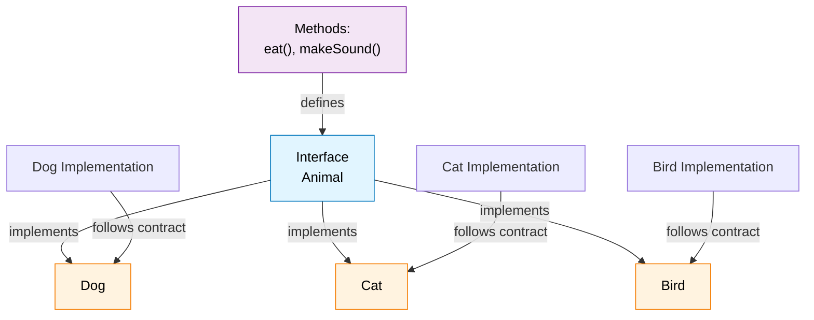

# PHP Interfaces

> **Last updated:** April 6, 2026  
> **Minimum PHP Version:** PHP 5.0+

## Overview

Interfaces allow you to specify what methods a class should implement. Interfaces define a contract that implementing classes must follow, enabling polymorphism and consistent method signatures across different classes.

### Interface Implementation Diagram




## When to Use

- Defining a contract for multiple related classes
- Enforcing consistent method names across implementations
- Enabling duck typing and polymorphism
- Creating flexible, loosely-coupled code
- Building plugin or extension systems

## Basic Example

```php
<?php
interface Animal {
    public function eat();
    public function makeSound();
}

class Dog implements Animal {
    public function eat() {
        echo "Dog is eating";
    }
    
    public function makeSound() {
        echo "Woof!";
    }
}

$dog = new Dog();
$dog->eat();        // Output: Dog is eating
$dog->makeSound();  // Output: Woof!
?>
```

## Advanced Example

```php
<?php
interface PaymentInterface {
    public function pay($amount);
    public function refund($transactionId);
}

class StripePayment implements PaymentInterface {
    public function pay($amount) {
        return "Processing \$$amount via Stripe";
    }
    
    public function refund($transactionId) {
        return "Refunding transaction $transactionId on Stripe";
    }
}

// Can use any PaymentInterface implementation
function processPayment(PaymentInterface $payment, $amount) {
    return $payment->pay($amount);
}
?>
```

## Comparison Table

| Feature | Interface | Abstract Class |
|---------|---|---|
| Can define methods | ✅ Yes | ✅ Yes |
| Can have implementations | ⚠️ (PHP 8.0+) | ✅ Yes |
| Can have properties | ❌ No | ✅ Yes |
| Can implement multiple | ✅ Yes | ❌ No (single inheritance) |
| Can be instantiated | ❌ No | ❌ No |

## Related Topics

- [Classes](./phpCls.md)
- [Abstract Classes](./phpAbstract.md)
- [Inheritance](./phpInheritance.md)
- [Traits](./phpTraits.md)

## PHP Version Support

**Introduced:** PHP 5.0  
**Minimum Required:** PHP 5.0+  
**Default Methods:** PHP 8.0+

## See Also

- [Official PHP Interfaces Documentation](https://www.php.net/manual/en/language.oop5.interfaces.php)

---

Interfaces allow you to specify what methods a class should implement.

Interfaces make it easy to use a variety of different classes in the same way. When one or more classes use the same interface, it is referred to as "polymorphism".

Interfaces are declared with the interface keyword.

``` php
<?php
interface InterfaceName {
  public function someMethod1();
  public function someMethod2($name, $color);
  public function someMethod3() : string;
}
?>
```

## Interfaces vs. Abstract Classes
Interface are similar to abstract classes. The difference between interfaces and abstract classes are:

+ Interfaces cannot have properties, while abstract classes can
+ All interface methods must be public, while abstract class methods is public or protected
+ All methods in an interface are abstract, so they cannot be implemented in code and the abstract keyword is not necessary
+ Classes can implement an interface while inheriting from another class at the same time

## Using Interfaces
To implement an interface, a class must use the implements keyword.

A class that implements an interface must implement all of the interface's methods.

The implements keyword is used to declare that a class must have the methods described in the specified interface. This is called polymorphism. Polymorphism makes it easy to use a variety of different objects in the same way.

``` php
<?php
interface Animal {
  public function makeSound();
}

class Cat implements Animal {
  public function makeSound() {
    echo "Meow";
  }
}

$animal = new Cat();
$animal->makeSound();
?>
```	

```	php
<?php
// Interface definition
interface Animal {
  public function makeSound();
}

// Class definitions
class Cat implements Animal {
  public function makeSound() {
    echo " Meow ";
  }
}

class Dog implements Animal {
  public function makeSound() {
    echo " Bark ";
  }
}

class Mouse implements Animal {
  public function makeSound() {
    echo " Squeak ";
  }
}

// Create a list of animals
$cat = new Cat();
$dog = new Dog();
$mouse = new Mouse();
$animals = array($cat, $dog, $mouse);

// Tell the animals to make a sound
foreach($animals as $animal) {
  $animal->makeSound();
}
?>
```