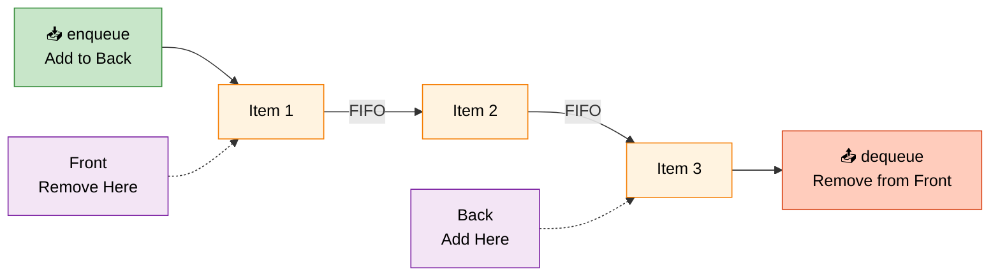

# SplQueue

> **Last updated:** April 6, 2026
> **Minimum PHP Version:** PHP 5.3+
> **Status:** Stable

## Overview

Queue (FIFO - First In First Out) data structure implementation. Perfect for managing task queues, request buffers, or any scenario where order matters.

### Queue Operation Diagram




## When to Use

-  Appropriate use case 1
-  Appropriate use case 2
-  Not for use case 1
- ❌ Not for use case 2

## Basic Example

```php
<?php
// Basic usage example
?>
```

## Advanced Example

```php
<?php
// Advanced usage example
?>
```

## Comparison

| Feature | SplQueue | Alternative |
|---------|---------|-------------|
| Use Case | Primary use | Secondary use |
| Performance | Fast | Varies |

## Related Topics

- [Arrays](phpArray.md) - Standard arrays
- [Iterables](phpIterables.md) - Iterable objects

## See Also

- [PHP SplQueue](https://www.php.net/manual/en/class.spl{title-lower}.php)
- [SPL Data Structures](https://www.php.net/manual/en/intro.spl.php)
