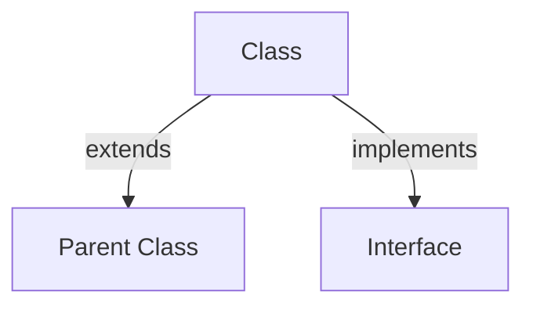

# Phase 3: Enhancement (Weeks 5-6)

## Overview
Phase 3 focuses on adding advanced features and enhancing the documentation experience. With Phases 1 and 2 establishing foundations and organization, Phase 3 now adds interactive elements, version-specific content strategies, and improved contribution pathways.

**Timeline:** Weeks 5-6 | **Effort:** 40-60 hours | **Impact:** MEDIUM-HIGH | **Dependencies:** Phase 1 & 2 complete

**Phase 3 Delivers:**
- Enhanced contribution guide with real-world examples
- Interactive content strategy and implementations
- Version-specific documentation approach (PHP 7.x vs 8.x)
- Advanced feature documentation
- Cross-reference system enhancements

---

## Initiative P3-1: Add Interactive Content

### Objective
Enhance documentation with interactive code examples that users can experiment with in-browser. This includes runnable snippets, visual diagrams, and interactive learning components.

### Current State
- Static code examples in markdown
- No ability for users to experiment
- No visual diagrams or interactive elements
- Limited interactivity beyond search

### Target State
- Runnable PHP code snippets (via SandBox/CodeSandbox)
- Visual diagrams for concepts (classes, inheritance, data structures)
- Interactive learning modules
- Best practice comparisons with before/after examples

### Implementation Options

**Option 1: Embed CodeSandbox (Recommended)**
```markdown
<iframe src="https://codesandbox.io/embed/php-example" style="width: 100%; height: 500px;"></iframe>
```

**Option 2: Tinybox / Local Runner**
```html
<div class="code-runner">
    <textarea class="php-code">
        <?php echo "Hello World"; ?>
    </textarea>
    <button onclick="runCode()">Run Code</button>
    <pre id="output"></pre>
</div>
```

**Option 3: Mermaid Diagrams**
```markdown

```

### Deliverables
1. **Interactive Code Examples** - Add to 5-10 key tutorial files
   - Variables basics
   - Control flow
   - Functions
   - Classes/OOP
   - Error handling

2. **Visual Diagrams** - Create for complex concepts
   - Class inheritance hierarchies
   - Data structure layouts
   - PHP execution flow

3. **Implementation Guide** - Document how to add interactive content

4. **Example Implementations** - Add 3-5 working examples

### Success Criteria
- ✅ At least 5 files have interactive code examples
- ✅ At least 3 visual diagrams present
- ✅ Guide for contributors to add more interactive content
- ✅ No broken embeds or external dependencies
- ✅ Mobile-friendly layouts

### Time Estimate
**20-30 hours**

---

## Initiative P3-2: Version-Specific Documentation Strategy

### Objective
Create a comprehensive strategy for documenting PHP version-specific features and differences. Enable users to focus on their target PHP version while understanding upgrade paths.

### Current State
- All files tagged with "Minimum PHP Version" (from Phase 1)
- No version-specific variants of files
- No upgrade guide from 7.4 → 8.x
- No version comparison tables

### Target State
- Version comparison tables showing feature availability
- Upgrade guides for each major version
- Version-specific examples (PHP 7.4 vs 8.0+ differences)
- "What's new in PHP X.Y" sections
- Feature matrices by version

### Implementation Approach

**1. Feature Matrix Documentation**
Create feature availability reference:
```markdown
## PHP Version Support

| Feature | PHP 7.4 | PHP 8.0 | PHP 8.1 | PHP 8.2 | PHP 8.3 |
|---------|---------|---------|---------|---------|---------|
| Named Arguments | ❌ | ✅ | ✅ | ✅ | ✅ |
| Attributes | ❌ | ✅ | ✅ | ✅ | ✅ |
| Enums | ❌ | ❌ | ✅ | ✅ | ✅ |
```

**2. Version-Specific Code Examples**
```markdown
## Implementation

### PHP 7.4 (Legacy)
```php
<?php
class User {
    public $name;
    public function __construct(string $name) {
        $this->name = $name;
    }
}
?>
```

### PHP 8.0+ (Modern)
```php
<?php
class User {
    public function __construct(public string $name) {}
}
?>
```
```

**3. Upgrade Path Documentation**
- Create "Upgrading from PHP 7.4 to 8.0" guide
- Create "What's New in PHP 8.1" section
- Document breaking changes and migration steps
- Provide deprecation warnings where relevant

### Deliverables
1. **Version Strategy Guide** - How to document version differences
2. **Feature Matrix** - Table of features by PHP version
3. **3-5 Upgrade Guides** - Version transition documentation
   - PHP 7.4 → 8.0
   - PHP 8.0 → 8.1
   - PHP 8.1 → 8.2
   - PHP 8.2 → 8.3

4. **Version-Specific Code Examples** - Update 10+ files with comparative examples
5. **Version Indicators** - Enhanced metadata with "available since" annotations

### Success Criteria
- ✅ Feature matrix covers PHP 7.4 through 8.3
- ✅ At least 3 upgrade guides created
- ✅ 10+ files show version-specific code examples
- ✅ All breaking changes documented
- ✅ Version strategy guide available for contributors

### Time Estimate
**15-25 hours**

---

## Initiative P3-3: Improve Contribution Guide

### Objective
Enhance CONTRIBUTING.md (created in Phase 1) with more practical guidance, examples, and workflows for different types of contributions.

### Current State
- CONTRIBUTING.md exists (from Quick Win 2)
- Basic setup and structure info
- Limited examples
- No workflow scenarios

### Target State
- Comprehensive contributor guide with scenarios
- Real-world examples of good vs. bad documentation
- Step-by-step contribution workflows
- Review checklist for maintainers
- Code of conduct and community guidelines
- Recognition system for contributors

### Deliverables
1. **Enhanced CONTRIBUTING.md** - Expand current guide
   - Detailed setup instructions (Windows/Mac/Linux)
   - Multiple contribution types:
     - Fixing typos/errors
     - Adding examples
     - Creating new files
     - Improving organization
   - Pull request templates
   - Code review guidelines

2. **PULL_REQUEST_TEMPLATE.md** - GitHub PR template
   ```markdown
   ## Description
   Brief summary of changes

   ## Type of Change
   - [ ] Bug fix
   - [ ] New content
   - [ ] Improvement
   - [ ] Documentation update

   ## Checklist
   - [ ] Follows template.md structure
   - [ ] PHP version indicators added
   - [ ] mkdocs build passes (no warnings)
   - [ ] Internal links verified
   - [ ] Related topics cross-linked
   ```

3. **CODE_OF_CONDUCT.md** - Community guidelines
   - Respectful collaboration
   - Inclusive community
   - Conflict resolution

4. **Example Contributions** - 3-5 worked examples
   - Good example: Well-structured new file
   - Poor example: Common mistakes
   - Improvement example: Enhancing existing content

5. **CONTRIBUTOR_RECOGNITION.md** - Hall of fame / contributors list

### Success Criteria
- ✅ CONTRIBUTING.md expanded to 5,000+ words
- ✅ PR template created and linked
- ✅ Code of conduct established
- ✅ 3-5 example contributions provided
- ✅ Clear workflows for different contribution types
- ✅ Recognition system documented

### Time Estimate
**10-15 hours**

---

## Phase 3 Summary

| Initiative | Effort | Impact | Status |
|-----------|--------|--------|--------|
| P3-1: Interactive Content | 20-30 hrs | Medium-High | Pending |
| P3-2: Version-Specific Docs | 15-25 hrs | High | Pending |
| P3-3: Contribution Guide | 10-15 hrs | Medium | Pending |
| **Total** | **45-70 hrs** | **HIGH** | **Pending** |

---

## Execution Order

**Recommended sequence:**
1. **P3-3 First** (Improve Contribution Guide) - 10-15 hours
   - Lower effort
   - Improves contributor experience immediately
   - Enables better future contributions

2. **P3-2 Second** (Version-Specific Docs) - 15-25 hours
   - High impact on user experience
   - Builds on Phase 1 version indicators
   - Helps users target their PHP version

3. **P3-1 Third** (Interactive Content) - 20-30 hours
   - Highest effort
   - Optional but high-value enhancement
   - Can be ongoing/iterative

---

## Quick Commands Reference

```bash
# Improve contribution guide
# 1. Expand CONTRIBUTING.md with sections and examples
# 2. Create PULL_REQUEST_TEMPLATE.md
# 3. Create CODE_OF_CONDUCT.md
# 4. Verify: mkdocs build --clean

# Add version-specific docs
# For each topic file:
# 1. Add feature availability table
# 2. Show code examples for PHP 7.4 vs 8.0+
# 3. Cross-link to upgrade guides
# 4. Verify: mkdocs build --clean

# Add interactive content
# For each interactive example:
# 1. Choose platform (CodeSandbox, Mermaid, etc)
# 2. Embed in markdown
# 3. Test on desktop and mobile
# 4. Verify: mkdocs build --clean

# Test all changes
mkdocs build --clean        # Build site
mkdocs serve                # Preview locally
npx playwright test         # Run test suite

# Commit each initiative
git add -A
git commit -m "[P3-X] Initiative description

Detailed explanation of changes.

Co-authored-by: Copilot <223556219+Copilot@users.noreply.github.com>"
```

---

## Success Metrics for Phase 3

| Metric | Current | Target |
|--------|---------|--------|
| Interactive Examples | 0 | 5+ |
| Visual Diagrams | 0 | 3+ |
| Version Guides | 0 | 5 (7.4→8.0, 8.0→8.1, etc) |
| Version-Specific Examples | 0 files | 10+ files |
| Contribution Documentation | Basic | Comprehensive |
| Community Guidelines | None | Established |

---

## Notes

- P3-1 can run in parallel with P3-2 (independent initiatives)
- P3-3 should complete first to improve future contributions
- Each initiative can be executed independently
- Interactive content can be enhanced iteratively
- Version documentation is ongoing as new versions release

---

## Next Steps After Phase 3

1. ✅ Polish and final testing
2. ✅ Community launch and announcement
3. ✅ Continuous improvement and maintenance
4. ✅ Version updates (PHP 9.x, new features)
5. ✅ User feedback incorporation
6. ✅ Advanced topics expansion

---

Last updated: **April 2026**  
Phase: **Enhancement (Phase 3)**  
Status: **Ready for execution**
