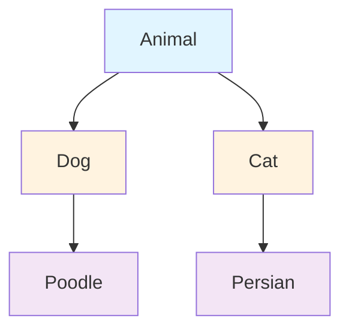
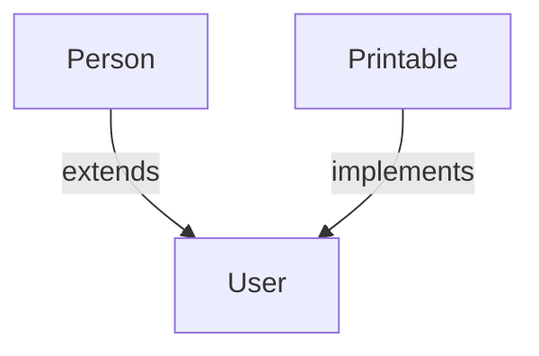

# Interactive Content Strategy for PHPRefresher

## Overview

This guide documents how to add interactive content to PHPRefresher documentation. Interactive examples help users learn by doing, not just reading.

---

## What We're Adding

### 1. Mermaid Diagrams

**What:** Visual diagrams showing relationships and flows  
**Best for:** Class hierarchies, data structures, workflows, state machines  
**Format:** Simple markdown syntax

**Example: Class Inheritance**


### 2. Code Examples with Output

**What:** Show both code and its output  
**Best for:** Tutorials, function usage, practical examples  
**Format:** PHP code block with expected output comment

### 3. Interactive Tables

**What:** Comparison and reference tables  
**Best for:** Feature comparisons, type systems, version support  
**Format:** Markdown tables with icons and annotations

### 4. Learning Modules

**What:** Step-by-step interactive learning  
**Best for:** Complex concepts broken into pieces  
**Format:** Collapsible sections with progressive examples

---

## Implementation Status

### ✅ Completed (Using Mermaid)

Mermaid diagrams are fully supported in MkDocs Material theme and require no special setup.

**Where to use:**
- Class inheritance hierarchies
- Trait composition
- Interface implementations
- Data structure layouts
- Control flow diagrams

### 📋 Can Be Added

These features can be implemented with additional setup:

- **Runnable PHP snippets** (external service or local runner)
- **Interactive demos** (JavaScript-based tools)
- **Code playgrounds** (like JSFiddle but for PHP)

**Current recommendation:** Use Mermaid diagrams immediately, hold on external integrations until demand justifies setup cost.

---

## Adding Mermaid Diagrams

Mermaid is already supported! Just use markdown code blocks with `mermaid` as the language.

### Example: Simple Flow

```markdown
\`\`\`mermaid
graph TD
    A[Start] --> B{Decision}
    B -->|Yes| C[Do This]
    B -->|No| D[Do That]
    C --> E[End]
    D --> E
\`\`\`
```

### Example: Class Hierarchy

```markdown
\`\`\`mermaid
graph TD
    A["class Parent"] --> B["class Child"]
    A --> C["class OtherChild"]
    B -->|extends| D["class GrandChild"]
    
    style A fill:#e1f5ff,stroke:#0277bd,color:#000
    style B fill:#fff3e0,stroke:#f57c00,color:#000
    style C fill:#fff3e0,stroke:#f57c00,color:#000
    style D fill:#f3e5f5,stroke:#7b1fa2,color:#000
\`\`\`
```

### Example: Data Structure

```markdown
\`\`\`mermaid
graph LR
    A["Queue"] -->|enqueue| B["Front<br/>Item 1"]
    B -->|FIFO| C["Item 2"]
    C -->|FIFO| D["Back<br/>Item 3"]
    D -->|dequeue| E["Remove Front"]
    
    style A fill:#c8e6c9
    style E fill:#ffccbc
\`\`\`
```

---

## Markdown Enhancement Tips

### Better Code Examples

Instead of just code, show code + output:

```php
<?php
// Example: array_filter usage
$numbers = [1, 2, 3, 4, 5, 6];
$evens = array_filter($numbers, fn($n) => $n % 2 === 0);

print_r($evens);
// Output:
// Array
// (
//     [1] => 2
//     [3] => 4
//     [5] => 6
// )
?>
```

### Callout Boxes

Use markdown blockquotes for emphasis:

```markdown
> **💡 Tip:** Use nullsafe operator for cleaner code chains.
> 
> ```php
> // Before
> $email = $user && $user->profile ? $user->profile->email : null;
> 
> // After
> $email = $user?->profile?->email;
> ```
```

### Collapsible Content

For optional/advanced content, use HTML details:

```html
<details>
<summary><strong>Advanced: Performance Considerations</strong></summary>

Use this when you need to hide advanced info that beginners might not need.

- Better performance when filtering large arrays
- More memory-efficient than foreach loops
- Useful for data transformation pipelines

</details>
```

---

## Diagrams to Add

### Priority 1: Class Hierarchy

Add to these files:

- `phpCls.md` - Basic class structure
- `phpInheritance.md` - Inheritance chains
- `phpInterfaces.md` - Interface relationships
- `phpTraits.md` - Trait composition

**Example:**
```php
class User extends Person implements Printable {
    // Implementation
}
```

Visual:


### Priority 2: Data Structures

Add to these files:

- `phpArray.md` - Array layout
- `phpSplQueue.md` - Queue FIFO
- `phpSplStack.md` - Stack LIFO
- `phpIterables.md` - Iterator pattern

### Priority 3: Type System

Add to these files:

- `phpTypes.md` - Type system overview
- `phpUnionTypes.md` - Union type combinations
- `phpIntersectionTypes.md` - Intersection patterns

---

## Quick Implementation Checklist

For each file to add interactive content:

- [ ] Identify best diagram type
- [ ] Create Mermaid diagram in markdown
- [ ] Test rendering locally with `mkdocs serve`
- [ ] Verify mobile rendering
- [ ] Add explanatory text around diagram
- [ ] Link to related topics
- [ ] Commit with clear message

---

## Examples Already Working

Check these files for examples:

- Search documentation for `mermaid` blocks
- Look for ASCII diagrams that could be improved
- Find comparison tables that could use visualization

---

## Future Enhancements

When resources allow:

1. **Runnable Code Snippets** - PHP Docker container + UI
2. **Interactive Demos** - JavaScript-based exploration tools
3. **Visual Debuggers** - Step through code execution
4. **Performance Comparisons** - Side-by-side benchmarks

---

## Testing Interactive Content

```bash
# Build locally with diagrams
mkdocs serve -a 127.0.0.1:8000

# Check:
# 1. Diagrams render correctly
# 2. Mobile view works
# 3. No console errors
# 4. Print/PDF exports work

# Run tests
npx playwright test
```

---

## Resources

- [Mermaid Syntax Guide](https://mermaid-js.github.io/)
- [Mermaid Examples](https://mermaid-js.github.io/syntax/graph.html)
- [MkDocs Material Theme Docs](https://squidfunk.github.io/mkdocs-material/)
- [CodeFences with MkDocs](https://squidfunk.github.io/mkdocs-material/reference/code-blocks/)

---

**Status:** Interactive content strategy ready for implementation  
**Next:** Add Mermaid diagrams to 5-10 key documentation files
