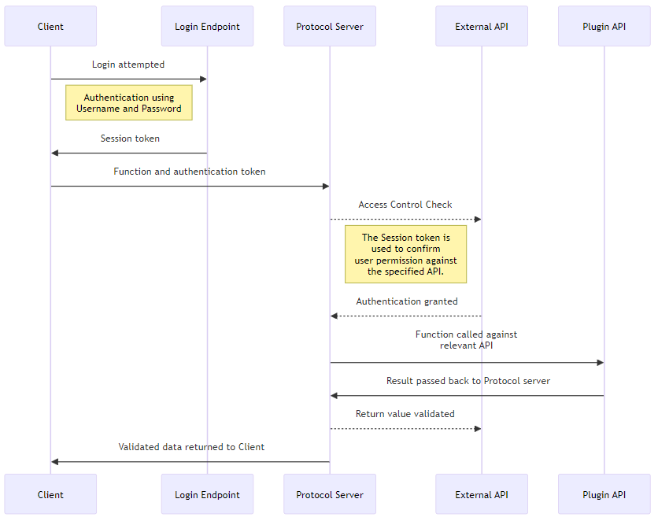

External web services in Moodle allow the platform to interact with external systems, 
providing a bridge for integrating Moodle with third-party applications such as mobile apps, 
external platforms, or custom systems. Moodle uses a standardized way to define, expose, 
and secure web services to ensure safe communication between systems.

Developing an external web service in Moodle involves several steps, including defining 
the functions to be exposed, creating the necessary security mechanisms, and managing 
user permissions. The Web Service framework and the External API work closely together providing a number of Endpoints, 
and self-describing classes to support a wide range of uses.

Moodle uses these web services internally for:

+ AJAX interactions in the Moodle Web Interface; and
+ The official Moodle Mobile App.

The following example shows a typical authentication and protocol workflow.



The External Service API has two categories of documentation:

+ this documentation details how to write a web service and use the External API; and
+ API documentation for a live Moodle site, which can be found under ** Site administration > Server > Web services > API Documentation **.

---

### 1. **Web Service Protocols**

Moodle supports multiple web service protocols, which determine how external systems 
can communicate with Moodle. Common protocols include:

- **REST (Representational State Transfer)**: A simple, lightweight protocol that uses HTTP 
requests (GET, POST, etc.).
- **SOAP (Simple Object Access Protocol)**: A more complex, XML-based protocol.
- **XML-RPC (Remote Procedure Call)**: Uses XML to encode calls and HTTP as the transport mechanism.
- **AMF (Action Message Format)**: A binary protocol primarily used for communication with Flash applications.

Moodle comes with built-in support for these protocols, and developers can configure which ones to use.

---

### 2. **Defining Web Service Functions**

A web service function is a PHP function that handles the logic of your web service. You can expose any PHP function in Moodle as a web service function, but it must be carefully structured to ensure security and proper behavior.

#### Steps to Define a Web Service Function:

1. **Create a Function in a Plugin or Core**:
    The function should be written in a plugin or within Moodle core. For example, let’s assume you are building a custom plugin to expose course-related data.

    ```php
    function local_customplugin_get_course_details($courseid) {
        global $DB;

        // Check if the course exists.
        $course = $DB->get_record('course', ['id' => $courseid]);
        if (!$course) {
            throw new moodle_exception('invalidcourse', 'local_customplugin');
        }

        // Return the course details.
        return array(
            'id' => $course->id,
            'fullname' => $course->fullname,
            'shortname' => $course->shortname,
            'summary' => $course->summary
        );
    }
    ```

2. **Register the Function in `db/services.php`**:
    Each function you wish to expose via web services needs to be declared in the `db/services.php` file of your plugin or core component. This file defines the web service function’s details, including its parameters, return values, and security restrictions.

    ```php
    $functions = array(
        'local_customplugin_get_course_details' => array(
            'classname' => 'local_customplugin_external',  // The external class that contains the function.
            'methodname' => 'get_course_details',  // The method name inside the class.
            'classpath' => 'local/customplugin/externallib.php',  // The file path to the external class.
            'description' => 'Returns details of a course.',
            'type' => 'read',  // The type of action (read, write, etc.).
            'ajax' => true,  // Enable it for AJAX use.
            'capabilities' => 'moodle/course:view',  // Specify required capabilities.
        ),
    );
    ```

3. **Create an External Class in `externallib.php`**:
    Web service functions should reside inside an external class that extends `external_api`, which handles permission checks and data validation.

    Example:

    ```php
    class local_customplugin_external extends external_api {
        // Define the parameters the function expects.
        public static function get_course_details_parameters() {
            return new external_function_parameters(
                array(
                    'courseid' => new external_value(PARAM_INT, 'Course ID')
                )
            );
        }

        // Implement the function logic.
        public static function get_course_details($courseid) {
            global $DB;

            // Validate parameters.
            $params = self::validate_parameters(self::get_course_details_parameters(), array('courseid' => $courseid));

            // Get course data.
            $course = $DB->get_record('course', array('id' => $params['courseid']));
            if (!$course) {
                throw new moodle_exception('invalidcourse', 'local_customplugin');
            }

            // Return the result.
            return array(
                'id' => $course->id,
                'fullname' => $course->fullname,
                'shortname' => $course->shortname,
                'summary' => $course->summary
            );
        }

        // Define the return values.
        public static function get_course_details_returns() {
            return new external_single_structure(
                array(
                    'id' => new external_value(PARAM_INT, 'Course ID'),
                    'fullname' => new external_value(PARAM_TEXT, 'Full course name'),
                    'shortname' => new external_value(PARAM_TEXT, 'Course short name'),
                    'summary' => new external_value(PARAM_RAW, 'Course summary'),
                )
            );
        }
    }
    ```

---

### 3. **Security Considerations**

Web services often expose sensitive data, so it’s critical to enforce strict security measures.

- **User Authentication**: Ensure that only authorized users can access your web services.
- **Capability Checks**: Use Moodle’s capabilities system to control access. For example, only users with the capability `moodle/course:view` can retrieve course details.
- **Parameter Validation**: Always validate and sanitize the input parameters using the `external_function_parameters` class.
- **Return Value Sanitization**: Ensure that the data returned is safe and free from XSS vulnerabilities.

---

### 4. **Managing Access Control**

Each web service function can have specific access controls that determine who can call it. Access is controlled via **tokens** and **capabilities**.

- **Tokens**: Users or systems must have a valid token to call a web service. Admins can issue these tokens through **Site administration > Server > Web services > Manage tokens**.
- **Capabilities**: Each function can define required capabilities in `db/services.php`, ensuring that users have the correct roles to access the web service.

---

### 5. **Authentication and Tokens**

Moodle uses tokens for authenticating users when they access web services. Tokens are generated for individual users or system accounts and can be issued in two ways:
- **Manually** by administrators: Through the admin interface.
- **Automatically**: Using Moodle’s authentication mechanisms (e.g., OAuth2).

#### Example: Creating a Token Manually

1. Go to **Site administration > Server > Web services > Manage tokens**.
2. Choose the user for whom the token will be created.
3. Assign the web service functions that this token allows access to.

---

### 6. **Service Configuration in the Moodle Admin Interface**

After defining your web service functions, you can configure them via the Moodle admin interface:

- **Enable Web Services**: Ensure web services are enabled in **Site administration > Advanced features**.
- **Configure Protocols**: Enable the desired web service protocols under **Site administration > Plugins > Web services > Manage protocols**.
- **Create a Service**: In **Site administration > Server > Web services > External services**, you can create and manage services, which are groups of related web service functions.
- **Assign Functions to the Service**: Add the functions defined in `db/services.php` to the service, so they are accessible externally.

---

### 7. **Example: Developing a Custom Web Service**

Let’s summarize the steps to develop a custom web service that exposes course details:

1. Write the web service function in an external class (`externallib.php`).
2. Define the function in `db/services.php`.
3. Create the required service, protocol, and token via the Moodle admin interface.
4. Use REST or another protocol to call the service from an external system, passing the token for authentication.

---

### 8. **Debugging and Testing**

To test web services:
- Use **Postman** or similar tools to make HTTP requests to the Moodle web services endpoint.
- Verify token validity and function calls.
- Use **Moodle’s web service test client** (available in **Site administration > Server > Web services > Manage services**) to 
manually test the functions.

For debugging:
- Enable debugging in **Site administration > Development > Debugging** to log errors.
- Use breakpoints in your IDE to inspect function behavior.

---

### Conclusion

Developing external web services in Moodle is a powerful way to extend the platform’s functionality and integrate it with 
third-party systems. It involves defining and registering functions, managing access control, and ensuring security through 
tokens and capability checks. By following the steps outlined above, you can create custom web services that allow Moodle to 
interact with external applications in a secure and maintainable manner.